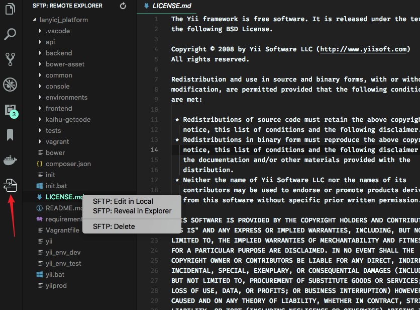

# SFTP Workbench

A Dreamweaver-style SFTP/FTP workflow for VS Code: folder compare with click-to-diff, staged transfers with overwrite confirmation, parallel connections, and a remote explorer - on top of the classic sync/upload-on-save workflow.

> ### Credits & lineage
>
> SFTP Workbench stands on the shoulders of two projects and their authors:
>
> - **[liximomo](https://github.com/liximomo)** wrote the original [vscode-sftp](https://github.com/liximomo/vscode-sftp) extension, whose architecture and feature set still form the core of this one.
> - **[Natizyskunk](https://github.com/Natizyskunk)** (Natan FOURIÉ) maintained and extended it for years as [Natizyskunk/vscode-sftp](https://github.com/Natizyskunk/vscode-sftp) ([marketplace listing](https://marketplace.visualstudio.com/items?itemName=Natizyskunk.sftp)) after the original was deprecated.
>
> This fork builds on Natizyskunk's line. If you find it useful, please consider [supporting the original authors](#credits--support-the-original-authors).

## Why this fork

The upstream extension is a great sync tool, but it stops short of a full folder workflow: there is no way to *see* what differs between local and remote before transferring, transfers silently overwrite whatever is on the other side, and everything funnels through a single connection. SFTP Workbench adds the missing Dreamweaver-like layer - compare first, confirm overwrites, skip identical files, watch progress, and run transfers in parallel - while keeping the configuration format and every command of the original.

## Features

### New in SFTP Workbench

- **Folder Compare** - compare a local folder against its remote counterpart, grouped into *Modified*, *Timestamp Only*, *New Remote*, and *New Local*, with click-to-diff. Includes group (whole-category) actions, compare-selected-files, reveal in local/remote explorer, per-file delete, and a persisted Flat / Group-by-Path layout toggle. See [Folder Compare](#folder-compare).
- **Clear Compare** - reset the Folder Compare view back to empty on demand.
- **Overwrite confirmation** (`confirmOverwrite`) - explicit uploads/downloads prompt before overwriting an existing destination file; folder-level transfers show one summary modal with a *Review in Compare View* option.
- **Diff-only transfer** (`skipUnmodified`) - explicit folder/project/multi-file transfers skip files already identical on the destination, the way Sync does.
- **Local download mirror** (`localDownloadPath`) - explicit downloads land in a configurable mirror folder (per-profile, in or outside the workspace) preserving the remote structure; uploads, re-downloads, compare, and diff of mirror files automatically map back to the true remote path. Uploads from outside the mirror are blocked (optional `disableUploadMenusOutsideLocalDownloadPath` also grays out their menu items).
- **Per-operation progress** - determinate per-file progress notifications with cancel, plus global pause/resume/stop for all transfers.
- **Parallel transfers** (`maxConnections`) - a per-profile connection pool so uploads, downloads, syncs, and folder walks genuinely run in parallel.

### Inherited from vscode-sftp

- Sync local ↔ remote (both directions)
- Upload on save, file watcher, temp-file support
- [Remote Explorer](#remote-explorer) for browsing the server
- Multiple configurations, contexts, and switchable profiles
- Connection hopping (SSH proxy)
- FTP / FTPS / SFTP protocols

## Roadmap

- **Password security in config** - move stored passwords out of plaintext `.vscode/sftp.json` into VS Code's `SecretStorage`, with a migration path for existing configs.
- **Custom location for the SFTP config file** - point the extension at an `sftp.json` outside the default `.vscode/` folder.
- **Configurable download location** - a per-profile download destination so explicit downloads can land outside the working `context` folder.
- Remaining Staged Transfer Workflow phases.

## Installation

Install **SFTP Workbench** from the VS Code Marketplace (extension id: `heuristics-io.sftp-workbench`).

> ⚠️ **Before installing:** disable or uninstall any other vscode-sftp variant (`liximomo.sftp`, `Natizyskunk.sftp`, or other forks). They register the same `sftp.*` commands, views, and settings - running two at once will make commands collide.

1. Select Extensions (Ctrl + Shift + X).
2. Disable/uninstall any other SFTP extension variants.
3. Search for `SFTP Workbench` and install.
4. Voilà!

Your existing `.vscode/sftp.json` keeps working unchanged - the configuration format, command ids, and settings are fully compatible with vscode-sftp.

## Documentation

- [Home](docs/home.md)
- [Settings](docs/setting.md)
- [Common configuration](docs/common_configuration.md)
- [SFTP configuration](docs/sftp_configuration.md)
- [FTP configuration](docs/ftp_configuration.md)
- [Commands](docs/commands.md)

## Usage

If the latest files are already on a remote server, you can start with an empty local folder,
then download your project, and from that point sync.

1. In `VS Code`, open a local directory you wish to sync to the remote server (or create an empty directory
that you wish to first download the contents of a remote server folder in order to edit locally).
2. `Ctrl+Shift+P` on Windows/Linux or `Cmd+Shift+P` on Mac open command palette, run `SFTP: config` command.
3. A basic configuration file will appear named `sftp.json` under the `.vscode` directory, open and edit the configuration parameters with your remote server information.

For instance:
```json
{
    "name": "Profile Name",
    "host": "name_of_remote_host",
    "protocol": "ftp",
    "port": 21,
    "secure": true,
    "username": "username",
    "remotePath": "/public_html/project", // <--- This is the path which will be downloaded if you "Download Project"
    "password": "password",
    "uploadOnSave": false
}
```
The password parameter in `sftp.json` is optional, if left out you will be prompted for a password on sync.
_Note：_ backslashes and other special characters must be escaped with a backslash.

4. Save and close the `sftp.json` file.
5. `Ctrl+Shift+P` on Windows/Linux or `Cmd+Shift+P` on Mac open command palette.
6. Type `sftp` and you'll now see a number of other commands. You can also access many of the commands from the project's file explorer context menus.
7. A good one to start with if you want to sync with a remote folder is `SFTP: Download Project`.  This will download the directory shown in the `remotePath` setting in `sftp.json` to your local open directory.
8. Done - you can now edit locally and after each save it will upload to sync your remote file with the local copy.
9. Enjoy!

For detailed explanations please see the [documentation](docs/home.md).

## Example configurations

You can see the full list of configuration options in the [configuration docs](docs/configuration.md).

### Simple
```json
{
  "host": "host",
  "username": "username",
  "remotePath": "/remote/workspace"
}
```

### Profiles
```json
{
  "username": "username",
  "password": "password",
  "remotePath": "/remote/workspace/a",
  "watcher": {
    "files": "dist/*.{js,css}",
    "autoUpload": false,
    "autoDelete": false
  },
  "profiles": {
    "dev": {
      "host": "dev-host",
      "remotePath": "/dev",
      "uploadOnSave": true
    },
    "prod": {
      "host": "prod-host",
      "remotePath": "/prod"
    }
  },
  "defaultProfile": "dev"
}
```

_Note：_ `context` and `watcher` are only available at root level.

Use `SFTP: Set Profile` to switch profile.

### Multiple Context
The context must **not be same**.
```json
[
  {
    "name": "server1",
    "context": "project/build",
    "host": "host",
    "username": "username",
    "password": "password",
    "remotePath": "/remote/project/build"
  },
  {
    "name": "server2",
    "context": "project/src",
    "host": "host",
    "username": "username",
    "password": "password",
    "remotePath": "/remote/project/src"
  }
]
```

_Note：_ `name` is required in this mode.

### Connection Hopping
You can connect to a target server through a proxy with ssh protocol.

_Note：_ Variable substitution is not working in a hop configuration.

#### Single Hop
local -> hop -> target
```json
{
  "name": "target",
  "remotePath": "/path/in/target",

  // hop
  "host": "hopHost",
  "username": "hopUsername",
  "privateKeyPath": "/Users/localUser/.ssh/id_rsa", // <-- The key file is assumed on the local.

  "hop": {
    // target
    "host": "targetHost",
    "username": "targetUsername",
    "privateKeyPath": "/Users/hopUser/.ssh/id_rsa", // <-- The key file is assumed on the hop.
  }
}
```

#### Multiple Hop
local -> hopa -> hopb -> target
```json
{
  "name": "target",
  "remotePath": "/path/in/target",

  // hopa
  "host": "hopAHost",
  "username": "hopAUsername",
  "privateKeyPath": "/Users/hopAUsername/.ssh/id_rsa" // <-- The key file is assumed on the local.

  "hop": [
    // hopb
    {
      "host": "hopBHost",
      "username": "hopBUsername",
      "privateKeyPath": "/Users/hopaUser/.ssh/id_rsa" // <-- The key file is assumed on the hopa.
    },

    // target
    {
      "host": "targetHost",
      "username": "targetUsername",
      "privateKeyPath": "/Users/hopbUser/.ssh/id_rsa", // <-- The key file is assumed on the hopb.
    }
  ]
}
```

### Configuration in User Setting
You can use `remote` to tell sftp to get the configuration from [remote-fs](https://github.com/liximomo/vscode-remote-fs) (a separate extension, also by liximomo).

In User Setting:
```json
"remotefs.remote": {
  "dev": {
    "scheme": "sftp",
    "host": "host",
    "username": "username",
    "rootPath": "/path/to/somewhere"
  },
  "projectX": {
    "scheme": "sftp",
    "host": "host",
    "username": "username",
    "privateKeyPath": "/Users/xx/.ssh/id_rsa",
    "rootPath": "/home/foo/some/projectx"
  }
}
```

In sftp.json:
```json
{
  "remote": "dev",
  "remotePath": "/home/xx/",
  "uploadOnSave": false,
  "ignore": [".vscode", ".git", ".DS_Store"]
}
```

## Folder Compare

Compare a local folder with its remote counterpart and see, per file, what differs:

- **Modified** - exists on both sides but the content differs (size differs, or same size with a differing modification time).
- **Timestamp Only** - identical size but the modification time differs. On FTP this is skipped (LIST mtimes are unreliable), so the group only appears for SFTP.
- **New Remote** - exists only on the remote.
- **New Local** - exists only locally.

How to use it:

1. Right-click a folder in the explorer (or a folder in the Remote Explorer), open the `SFTP` submenu, and pick `Compare Folder with Remote`; or run `SFTP: Compare Active Folder with Remote` from the command palette.
2. The **Folder Compare** view in the SFTP activity bar container shows the groups above (empty groups are hidden). `ignore` rules from your config apply.
3. Open the view's `...` menu and choose **Group by Path** to nest folders below each
   status, or **Show Flat List** to restore the filename + parent-path list. The choice
   is saved for the workspace; switching layout does not re-run comparison.
4. Click a _Modified_ or _Timestamp Only_ entry to open a diff. Use the per-entry inline actions to download, upload, or match-timestamp an entry; the comparison re-runs afterwards. The refresh button re-runs the comparison at any time; the clear button next to it empties the view.

To compare just a **file or a handful of files**, select them (in the explorer, the Remote Explorer, or an editor tab), open the `SFTP` submenu, and pick `Compare File with Remote`. Only those files load into the view, and **Refresh** re-runs that same selection instead of widening to the parent folder. From a Remote Explorer file you can also pick `Diff with Local` to open a direct diff of that remote file against its local copy.

Right-click a compare file or a path folder to reveal it on the side guaranteed to
exist by its status:

| Status | Reveal | Per-file delete |
| --- | --- | --- |
| **Modified** / **Timestamp Only** | Local Explorer and Remote Explorer | None |
| **New Remote** | Remote Explorer | **Delete on Remote** (modal confirm) |
| **New Local** | Local Explorer | **Delete Locally** (modal confirm) |

Delete warnings name the exact relative path and affect only that file. Path-folder
nodes are organizational: they can be revealed, but cannot be transferred or deleted
as a batch.

### Group (whole-category) actions

Right-click a **group header** to act on every file in that category at once. The offered actions are context-aware, and the destructive ones require a modal confirmation naming the file count:

| Group | Actions |
| --- | --- |
| **Modified** | **Download from Remote** / **Upload to Remote** - overwrite one side with the other (confirm; cannot be undone). |
| **Timestamp Only** | **Match Timestamp (Use Remote)** / **Match Timestamp (Use Local)** - align mtimes without transferring content (no confirm). |
| **New Remote** | **Download from Remote** - pull all remote-only files locally. **Delete on Remote** - remove them from the server (confirm). |
| **New Local** | **Upload to Remote** - push all local-only files. **Delete Locally** - remove them from disk (confirm). |

Files are processed sequentially (FTP serializes on a single control connection), then the comparison refreshes once.

_Note:_ with a non-zero `remoteTimeOffsetInHours` the _Modified_ group may over-report changes (known upstream time-offset round-trip issue).

## Remote Explorer


Remote Explorer lets you explore files in remote. You can open Remote Explorer by:

1. Run Command `View: Show SFTP`.
2. Click SFTP view in Activity Bar.

You can only view a files content with Remote Explorer. Run command `SFTP: Edit in Local` to edit it in local.

### Multiple Select
You are able to select multiple files/folders at once on the remote server to download and upload. You can do it simply by holding down Ctrl or Shift while selecting all desired files, just like on the regular explorer view.

_Note：_ You need to manually refresh the parent folder after you **delete** a file if the explorer isn't correctly updated.

### Order
You can order the remote Explorer by adding the `remoteExplorer.order` parameter inside your `sftp.json` config file.

In sftp.json:
```json
{
  "remoteExplorer": {
    "order": 1 // <-- Default value is 0.
  }
}
```

## Debug
1. Open User Settings.
  - On Windows/Linux - `File > Preferences > Settings`
  - On macOS - `Code > Preferences > Settings`
2. Set `sftp.debug` to `true` and reload vscode.
3. View the logs in `View > Output > sftp`.

## FAQ
You can see all the Frequently Asked Questions [here](./FAQ.md).

## Credits & support the original authors

SFTP Workbench takes no donations. If this extension saves you time, please support the people who built the foundation:

- **Natizyskunk** - [Buy Me a Coffee](https://www.buymeacoffee.com/Natizyskunk) · [PayPal](https://www.paypal.com/donate?business=DELD7APHHM3BC&no_recurring=0&currency_code=EUR) · [PayPal.me](https://paypal.me/natanfourie)
- **liximomo** - original author of [vscode-sftp](https://github.com/liximomo/vscode-sftp)
